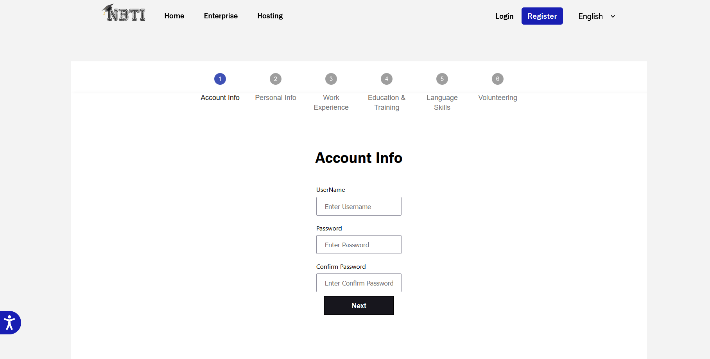
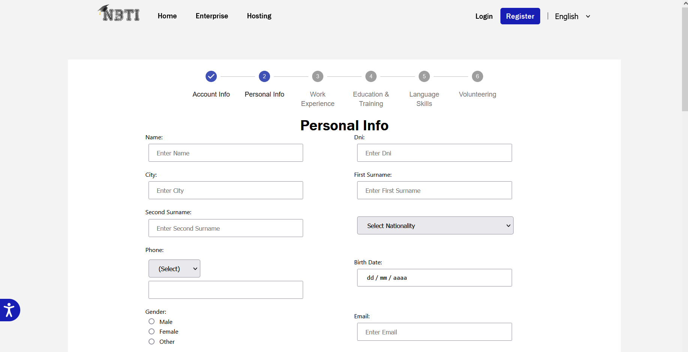
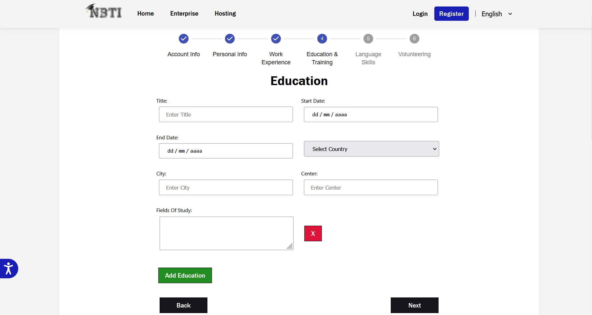

##### [Volver a Ejecución del Proyecto](ejecucion.md)

# Documentación del sistema

## Manual de instalación y configuración de la aplicación

Para desplegrar Aws, primero necesitamos subir el paquete del proyecto con el comando:

`mvn clean package shade:shade`

Y después subirlo a Aws Lamba con tu usuario IAM.

El Proyecto puede ser testeado en local por cualquier App de Spring, donde podrás desplegarlo en un server local.

Como se puede observar Lambda, CloudWatch y Api Gateaway son los que más se utilizaron.

Información General de _Lambda_.

Configuración General de _CloudWatch_.

Aqui podemos ver la utilización de los recursos con sus necesarios gets, puts y post para que puedan crearse, cambiarse o modificarse. 

## Manual de usuario

#### Vista principal(_Home_):

Al Entrar en la Página Web veremos una descripción de que es Nbti, con un Carrusel de fotos.
En la parte superior vemos diferentes pestañas para movernos por la página como puede ser Home, Enterprise, Hosting y a la derecha el login, el registro y 
el cambio de idioma si no entiendes Inglés. El Iconito que tenemos en la parte izquierda de la página es el plugin de acessibilidad que ayuda a las personas con discapicidad 
o personas mayores.

#### Vista del formulario para Empresas:

Aqui empresas interesadas en trabajar con NBTI pueden dar su información de contacto.

#### Vista del formulario para Hospedajes:

En esta vista familias de acogida o quien quiera puede dar sus datos de contacto para que NBTI tenga su información.

#### Vista de registro de estudiantes:

Esta es la vista con la primera parte del formulario que vamos a poder rellenar con nuestra información tipica de un curriculum y una cuenta.

Al tener que rellenar tanta información, cada apartado tiene un tema específico y podremos rellenarlo poco a poco.

En el primer paso se rellena y valida la información básica de nosotros.

En este paso se rellena la mayoría de la información personal de nosotros, incluidas fotos del DNI, teléfono, etc.

En este paso podemos añadir las diferentes experiencias de trabajo, usando los botones para añadir o quitar las que necesite.

Igual que en el anterior, puede rellenar tantas formaciones/educaciones como queramos.

Aquí pueden especificar los idiomas que domine y a qué nivel. Formato similar a los anteriores.

En el último paso puedo rellenar su experiencia de voluntariado, también formato con lista de formularios.

#### Barra de navegación:

En la barra de navegacion podemos acceder a las vistas principales, y si la sesión esta iniciada muestra la foto de perfil en un botón.

Este botón despliega las diferentes opciones para usuarios registrados.

#### Vista del perfil de estudiante.

Yo al estar registrado puedo acceder a mi perfil y ver la información que rellene en mi registro. En esta vista hay dos subvistas, la principal que vemos arriba.

Y en la otra vista podemos ver un pdf con un curriculum generado con mis datos de estudiante.

##### [siguiente Sección: Conclusiones del Proyecto](conclusiones.md)
