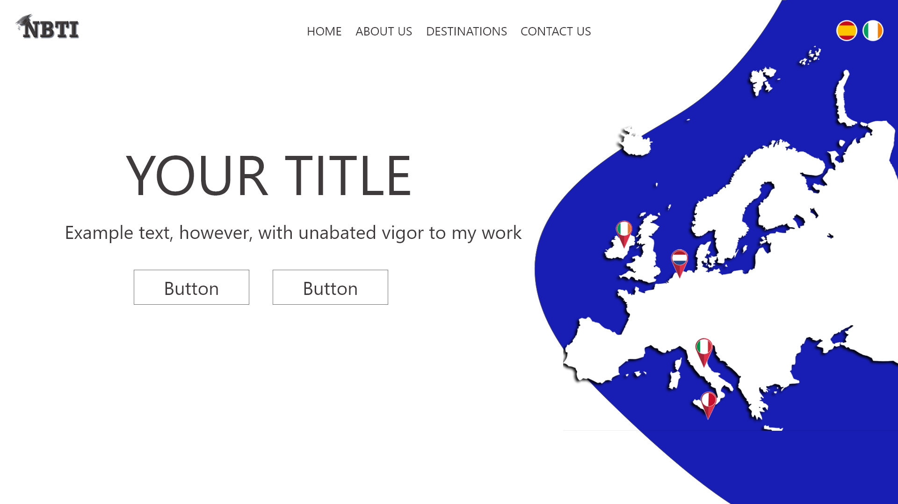
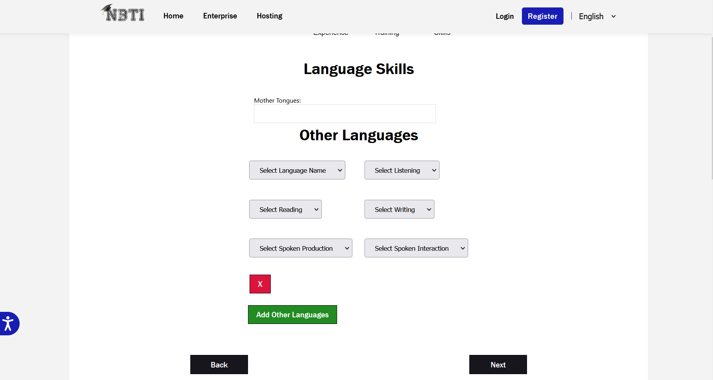
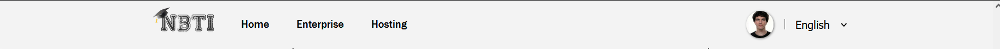

#### [Volver a Estudio del problema](estudio.md)

# Ejecución del Proyecto

## Documentación e implementación del proyecto de FRONT END

### Configuración inicial
Para crear el proyecto inicial de react usamos [_Create React App_](https://github.com/facebook/create-react-app) que nos genera un proyect vacio de _React_, pero ya con todas las dependencias esenciales para el proyecto, y con algunos comandos integrados como:
- `npm start`: Ppara lanzar en un servidor de desarrollo local la pagina
- `npm build`: Para empaquetar el proyecto para un despliegue real.
- `npm test` : para ejecutar test de la aplicación.

La estructura de archivos del proyecto se basa en la plantilla basica de React que hemos usado, 

  
 
 teniendo una carpeta `src` que contiene todo el codigo fuente del proyecto, dividido en subcarpetas para organizar paginas, componentes, servicios, etc
 
  

### Diseño de la página

Para el rediseño se plantearon varios _mock ups_ orientativos de la nueva pagina:

Tras consultarlo con supervisores se decidió seguir el estilo del último ejemplo.

Siguiendo este diseño base, se diseña e implementa en react la nueva página. Las vistas en las que se decide que se va a dividir son:

#### Vista principal(_Home_):

Es la _landing page_ que ve un usario nada más entrar, muestra cierta información clave y sirve como portal de entrada al resto de vistas.

#### Vista de _Log In_:
Accesible en la barra de navegación, es desde donde los estudiantes ya registrados pueden iniciar sesión.

#### Vista del formulario para Empresas:

Aqui empresas interesadas en trabajar con NBTI pueden dar su información de contacto.

#### Vista del formulario para Hospedajes:

En esta vista familias de acogida o quien quiera puede dar sus datos de contacto para que NBTI tenga su información.

#### Vista de registro de estudiantes:

Esta es la vista con el formulario mas complejo, ya que vamos a hacer que el estudiante rellene toda la información de su curriculum y su cuenta.

Al tener que rellenar tanta información, hemos segmentado el fomrulario en varios pasos para mejorar la experiencia de usuario, con una barra de progreso.

En el primer paso se rellena y valida la información básica de usuario.

En este paso se rellena la mayoría de la información personal del estudiante, incluidas fotos del DNI, teléfono, etc.

En este paso el estudiante puede añadir las diferentes experiencias de trabajo, usando los botones para añadir o quitar las que necesite.

Igual que en el anterior, puede rellenar tantas formaciones/educaciones como quiera el estudiante.

Aquí pueden especificar los idiomas que dominen y a qué nivel. Formato similar a los anteriores.

En el último paso pueden rellenar su experiencia de voluntariado, también formato con lista de formularios.

#### Barra de navegación:

En la barra de navegacion podemos acceder a las vistas principales, y si la sesión esta iniciada muestra la foto de perfil en un botón.

Este botón despliega las diferentes opciones para usuarios registrados.

#### Vista del perfil de estudiante.

Un estudiante registrado pued acceder a su perfil y ver la información que rellenó en su registro. En esta vista hay dos subvistas, la principal que vemos arriba.

Y en la otra vista podemos ver un pdf con un curriculum generado con los datos del estudiante.

### Implementación de la aplicación REACT

