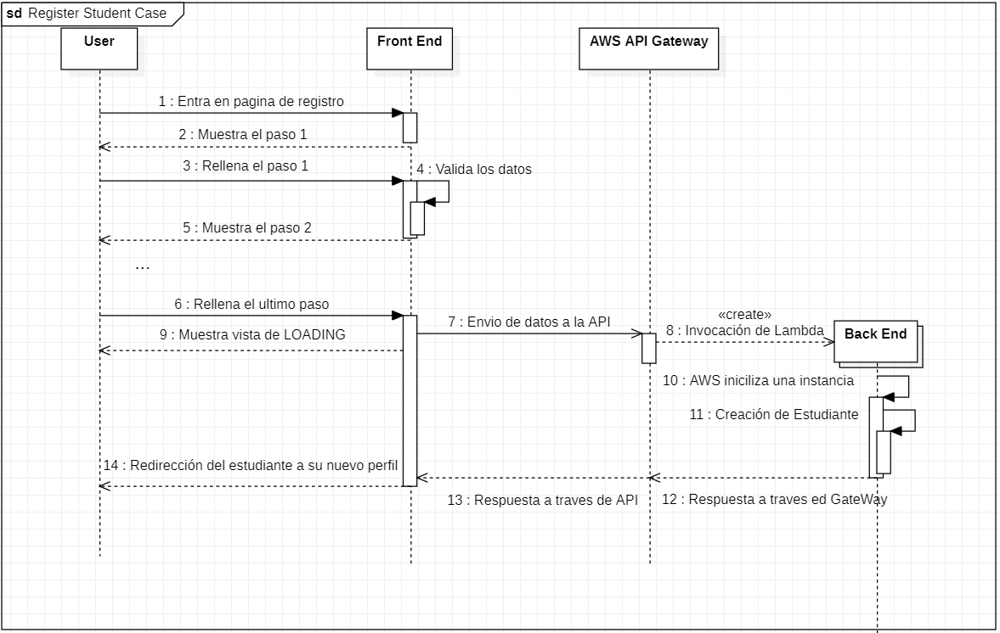

##### [Volver a Estudio del problema](estudio.md)

# Ejecución del Proyecto

## Documentación e implementación del proyecto de FRONT END

### Configuración inicial
Para crear el proyecto inicial de react usamos [_Create React App_](https://github.com/facebook/create-react-app) que nos genera un proyect vacio de _React_, pero ya con todas las dependencias esenciales para el proyecto, y con algunos comandos integrados como:
- `npm start`: Ppara lanzar en un servidor de desarrollo local la pagina
- `npm build`: Para empaquetar el proyecto para un despliegue real.
- `npm test` : para ejecutar test de la aplicación.

La estructura de archivos del proyecto se basa en la plantilla basica de React que hemos usado, 

  
 
 teniendo una carpeta `src` que contiene todo el codigo fuente del proyecto, dividido en subcarpetas para organizar paginas, componentes, servicios, etc
 
  

### Diseño de la página

Para el rediseño se plantearon varios _mock ups_ orientativos de la nueva pagina:


Tras consultarlo con supervisores se decidió seguir el estilo del último ejemplo.

Los casos de uso a tener en cuenta para la web son: un caso para el registro del estudiante, otro para cuando inicie sesión, y otro para visitar su perfil, ademas, estan los casos de uso de empresas o alojamientos usando los formularios de contacto.

 Un diagrama simplificado de casos de uso

Siguiendo este diseño base, se diseña e implementa en react la nueva página. Las vistas en las que se decide que se va a dividir son:

#### Vista principal(_Home_):

Es la _landing page_ que ve un usario nada más entrar, muestra cierta información clave y sirve como portal de entrada al resto de vistas.


#### Vista de _Log In_:
Accesible en la barra de navegación, es desde donde los estudiantes ya registrados pueden iniciar sesión.


#### Vista del formulario para Empresas:

Aqui empresas interesadas en trabajar con NBTI pueden dar su información de contacto.


#### Vista del formulario para Hospedajes:

En esta vista familias de acogida o quien quiera puede dar sus datos de contacto para que NBTI tenga su información.


#### Vista de registro de estudiantes:

Esta es la vista con el formulario mas complejo, ya que vamos a hacer que el estudiante rellene toda la información de su curriculum y su cuenta.


Al tener que rellenar tanta información, hemos segmentado el fomrulario en varios pasos para mejorar la experiencia de usuario, con una barra de progreso.


En el primer paso se rellena y valida la información básica de usuario.


En este paso se rellena la mayoría de la información personal del estudiante, incluidas fotos del DNI, teléfono, etc.


En este paso el estudiante puede añadir las diferentes experiencias de trabajo, usando los botones para añadir o quitar las que necesite.


Igual que en el anterior, puede rellenar tantas formaciones/educaciones como quiera el estudiante.


Aquí pueden especificar los idiomas que dominen y a qué nivel. Formato similar a los anteriores.


En el último paso pueden rellenar su experiencia de voluntariado, también formato con lista de formularios.

#### Barra de navegación:


En la barra de navegacion podemos acceder a las vistas principales, y si la sesión esta iniciada muestra la foto de perfil en un botón.


Este botón despliega las diferentes opciones para usuarios registrados.

#### Vista del perfil de estudiante.


Un estudiante registrado pued acceder a su perfil y ver la información que rellenó en su registro. En esta vista hay dos subvistas, la principal que vemos arriba.


Y en la otra vista podemos ver un pdf con un curriculum generado con los datos del estudiante.

Para ejemplificar con mas detalle un ciclo completo de un caso de uso, veamos el diagrama de secuencia del caso mas complejo, el registro del estudiante:




### Implementación de la aplicación REACT


La apliación web funciona con una _Single Page Website_, existe un archivo HTML raíz, que el _framework_ cambia dinamicamente para mostrar el contenido que queramos. Todo el marcado y diseño de la pagina se hace a traves de HTML generado en ficheros _Javascript_. definiendo funciones especiales: componentes de _React_.

#### Componentes de _REACT_

 Un componente de React no es mas que una función de javascript que retorna HTML, y que debe cumplir algunas convenciones, como ser una *función pura*


Este es un ejemplo sencillo de un componente de _React_:
```
import React from "react";
import "./styles.css";

function DownloadButton({ children }) {
  return (
    <>
      <button className="button">
        <span className="button_lg">
          <span className="button_sl"></span>
          <span className="button_text"> {children} </span>
        </span>
      </button>
    </>
  );
}

export default DownloadButton;
```


podemos llamar a un componente de _React_ dentro de codigo HTML llamandolo como una etiqueta HTML:

`<DownloadButton>Download in English</DownloadButton>`

Combinando componentes podemos crear una página web compuesta por diferentes componentes reutilizables.

#### Componente principal y Router

_React_ proporciona un sistema para redirigir el contenido segun la ruta escrita en la página, el componente principal de la _web_ contiene una barra de navegación y las diferentes rutas posibles para la página:


```
import ...

function App() {
  const [locale, setLocale] = useState(
    localStorage.getItem("language") === "es"
      ? LOCALES.SPANISH
      : LOCALES.ENGLISH
  );

  return (
    /** Provider to changes languages */
    <I18Provider locale={locale}>
      <Navbar setLocale={setLocale} />

      {/* ROUTES */}

      <ThemeProvider theme={theme}>
         <Routes>
        <Route path="/" element={<Home />} />
        <Route path="/enterprise" element={<Enterprise />} />
        <Route path="/hosting" element={<Hosting />} />
        <Route path="/encrypt" element={<Encrypt />} />
        <Route path="/login" element={<LoginAuth />} />
        <Route path="/register" element={<CvPage />} />
        <Route path="/profile" element={<Profile />} />
        <Route path="/spinner" element={<Spinner />} />
        <Route path='/edit/:id' element={<Edit/>}/>
        <Route path="*" element={<h1>Error 404</h1>} />
      </Routes>
      </ThemeProvider>

      <Footer />
      <Cookies />
    </I18Provider>
  );
}

export default App;


```

Diferentes rutas renderizan diferentes componentes de _React_.

#### _Hooks_ de _React_

Una funcionalidad clave de React, que se usa en todas partes del código, es el uso de _hooks_ una estructura para controlar información dinamicamente a través de componentes teniendo en cuenta el ciclo de renderizado de la web.

##### State Hook:

Esta es la estructura más simple, permite persistir un valor/objeto de _Javascript_ a traves de renderizados de la web. se usa llamando a `useState()`, un ejemplo de nuestro proyecto:

` const [student, setStudent] = useState({});`

El _hook_ nos devuelve dos variables: la primera el *accesor* desde donde leemos el valor guardado en el _hook_ y la segunda un método para modificar el valor en el _hook_

##### Effect Hook:

está estructura permite ejecutar código en cada renderizado, o cuando cambie el valor de hook del componente, se usa normalmente para manejar efectos secundarios en la página, animaciones, operaciones que dependen de otros cambios, etc.
```
 useEffect(()=>{
    AuthService.getCurrentUser().then((user) => {
      if (user != null) {
        navigate("/");
      }
    });
  }
  ,[] )
```
En este ejemplo se usa para que el componente recupere los datos de usuario en el primer renderizado.


#### Generación dinámica de formularios:

Una de las partes mas extensas de este proyecto es lidiar con un formulario con un gran cantidad potencial de datos, para esto, hemos implementado un sistema que genera formularios según un objeto JSON que describe la estructura del formulario. 

Un ejemplo de estos archivos JSON:

```
{
  	name: { type: "text", validation: "text" },
	dni: { type: "text", validation: "text" },
	city: { type: "text", validation: "text" },
	photo: { type: "image", validation: "basic" },
	firstSurname: { type: "text", validation: "text" },
	secondSurname: { type: "text", validation: "text" },
	nationality: {
	  type: "option",
	  options: nationalityOptions,
	  validation: "basic",
	},
	phone: { type: "phone", validation: "phone" },
	birthDate: { type: "date", validation: "basic" },
	gender: {
	  type: "radio",
	  options: ["Male", "Female", "Other"],
	  validation: "basic",
	},
	email: { type: "email", validation: "email" }
}
  ```
Este JSON esta dandonos que campos debe tener el formulario, de que tipo, y que validacion requiere, aparte de algunos valores para tipos especiales de inputs.


```
export function inputGeneration(inputs, values, onChange, formik) {
  const inputHtml = [];
  for (const [key, input] of Object.entries(inputs)) {
    let currentInput;
    switch (input.type) {
      case "tags":
          currentInput=(
            <div>
            <TagInput
            label={key} 
            value = {values[key]}
            onChange={onChange} 
            whitelist= {input.whitelist}
            formik={formik}
            />
            </div>
          )
        break;
      case "radio":
      ...
```

este JSON es procesado con esta función junto con el objeto de valores que van a ser asociados a cada _input_ y la función que va a manejar los cambios en el formulario. La funcón genera html encadenando componentes de React personalizados para cada input, segun el JSON aportado.

Para el caso de formularios como el de experiencia laboral, que podian ser multiples formularios iguales, hay un componente especial para el esos casos, que usa recursividad para volver a llamar a la función generador de formularios, `inputGeneration`, repitiendo el proceso.

```
...
 const formArray = values.map((element, index) => {
    return (
      <>
        <ArrayDiv className="col" key={index}>
          {inputGeneration(
            inputList,
            props.values[index],
            (e) => subOnChange(e, index),
            formik[index]
          )}
...
```


#### Generación de curriculum en PDF:

Además de guardar la información del curriculum del estudiante, tambien tenemos que generar una versión PDF del curriculum, para ello usamos _pdfMake_. una libreria que nos permite generar pdfs según un objeto JSON que define el contenido y la estructura. Parecido a lo que hemos hecho nosotros para generar formularios, pero en este caso es una libreria externa, y los JSON son mas complejos pues tambien estilizan el PDF.

Ejemplo de configuracion de _PdfMake_

```
...
 style: ["font"],
      alignment: "justify",
      margin: [0, 5, 0, 0],
      text: [
        {
          text: `${value.title}.
     `,
          bold: true,
          italics: false,
          fontSize: 15,
        },

        `${value.company} [${value.startDate}]  [${value.endDate}]
      
...
```


## Implementación del proyecto de _Spring_
El proyecto de Spring es una _Restful API_ Cuya única función es recibir y manejar peticiones y hacer la conexión con la base de datos.
### Configuración inicial
El proyecto inicial de _Spring_ se ha generado usando [Spring initializr](https://start.spring.io/). Aquí podemos elegir las dependecias que va a tener el proyecto y se nos generá un proyecto de maven con las dependencias de _Spring Data JPA_, _Spring Security_, _Spring MVC_ y _PostgreSQL_ que vamos a usar, y posteriormente añadiremos a `pom.xml` la dependencia:
```
<dependency>
			<groupId>com.amazonaws.serverless</groupId>
			<artifactId>aws-serverless-java-container-springboot2</artifactId>
			<version>1.8</version>
</dependency>
```
Que también necesitaremos para el despliegue en AWS.
### Estructura del código
La estructura del proyecto será MVC, pero como no tenemos acceso a las vistas desde este proyecto, la separación va a ser entre *modelos*, *repositorios*, *servicios* y *controladores*.
#### Modelos de datos
En el paquete de modelos tendremos una serie de clases de _Java_ anotadas con _JPA_ que _Spring_ usará para hacer la estructura de la base de datos relacional. 


Arriba está el diagrama de clases de Java, que tambien sirve como modelo para la base de datos relacional. A fin de cuentas con _Spring_ vamos a generar la base de datos a traves de nuestra estructura de clases en _Java_.

Este modelo esta pensado para las necesidades de la empresa, y contiene clases extra que no se van a usar en la página, como los pagos, pero que hemos incluido por claridad y para asegurarnos de que en el futuro no haya problemas al implementar más funcionalidades, que no entran en el alcance de este proyecto.

```
@Entity
@Table(name = "STUDENT")
public class Student extends NbtiEntity implements Payee {

	@OneToOne
	@JoinColumn(name = "photo_id")
	private NBTIFile photo;

	private String name;

	private String dni;

	private String city;

	private String typeOfStudent;
...
```
Extracto de ejemplo de una entidad modelo.
#### Repositorios
La conexión con base de datos se hace en una serie de clases que llamamos _repositorios_. Que contienen la lógica que conecta con JDBC a nuestra base de datos. Spring tiene un sistema por el cual es capaz de generar todos los repositorios automáticamente por reflexión, solo mirando las clases del modelo y sus anotaciones. No solo crea las clases para conectar DB, si no que también se encarga de crear las tablas necesarias si no estan creadas, por lo que es responsable también de la definición de la base de datos.

```
public interface StudentRepository extends JpaRepository<Student, Long>{
	
	Optional<Student> findByUser(User user);
}
```
Interfaz repositorio de Student.
#### Controladores
Esta serie de clases son las que reciben las peticiones a la API, y las que se encargan de devolver las respuestas. Las peticiones y llamadas casi siempre bien en formato JSON, y Spring Rest se encarga de intentar convertirlas en la clase de Java que esperamos. Las clases que usamos para modelar las peticiones y respuestas las llamamos _DTO_, _Data Transfer Object_. 
##### DTO
Un DTO no es mas que una clase estandar de Java, que representa la información de un modelo que queremos transferir a otro sistema, en este caso, a traves de la API. Esta separación nos da más control de la información que mandamos por la red, y nos da más seguridad al no tener que acceder a las clases entidades conectadas a la base datos salvo cuando sea estrictamente necesario.
```
public class StudentDto {

	private Long id;
	private Long userId;
	private Long photoId;
	private Long dniFrontId;
	private Long dniBackId;
	private String name;
	private String dni;
	private String city;
  ...
```

Los controladores reciben y mandan DTOs que representan el modelo que controlen, su función es mandar la respuesta a la capa de servicio para que se procese, y decidir el tipo de respuesta API en función de lo que le devuelva el servicio.
```

@RestController
public class StudentController {

@Autowired
	private StudentService studentService;

... 

@GetMapping("/student/{id}")
	public ResponseEntity getById(@PathVariable Long id) {
		try {
			System.out.println("returning student with id " + id);
			StudentDto student = studentService.checkedFindDtoById(id);

			return new ResponseEntity<>(student, HttpStatus.OK);
		} catch (NoSuchElementException e) {
			return new ResponseEntity<>(NOT_FOUND_STR, HttpStatus.NOT_FOUND);
		} catch (Exception e) {
			return new ResponseEntity<>(e.getLocalizedMessage(), HttpStatus.INTERNAL_SERVER_ERROR);
		}
	}
  ...
```
Extracto de StudentController.
#### Servicios
Tenemos un servicio por cada modelo y es la capa donde se procesa el DTO, se valida la información y autorizaciones, y se invoca a los repositorios pertinentes para persistir información en la base de datos.

```
@Service
@Transactional
public class StudentServiceImpl implements StudentService {

	@Autowired
	StudentRepository repo;
...

public Student checkedFindById(Long id) {
		Student student = repo.findById(id).get();
		if (student.getUser() == null)
			throw new NoSuchElementException();
		AuthUtils.authUser(student.getUser());
		return student;
	}
...
```
Extracto de implementación de StudentService
### Integración con AWS
Para que el servicio _Lambda_ de AWS al que vamos a subir el _back end_ entienda como usar el proyecto de Spring, tenemos que especificar en AWS Lambda cual va a ser la función del proyecto que debe invocar para arrancar el servidor, y esta función debe estar preparada para recibir las peticiones de AWS. Para esto tenemos la clase, `AwsLambdaHandler`:
```
public class AwsLambdaHandler implements RequestStreamHandler {
    private static SpringBootLambdaContainerHandler<AwsProxyRequest, AwsProxyResponse> handler;
    
    static {
        try {
            handler = SpringBootLambdaContainerHandler.getAwsProxyHandler(NbtiBackEndApplication.class);
        } catch (ContainerInitializationException e) {
            // if we fail here. We re-throw the exception to force another cold start
            e.printStackTrace();
            throw new RuntimeException("Could not initialize Spring framework", e);
        }
    }

    @Override
    public void handleRequest(InputStream inputStream, OutputStream outputStream, Context context)
            throws IOException {
    	  
        handler.proxyStream(inputStream, outputStream, context);
    }

}
```
### Seguridad 0Auth 2.0
La seguridad se maneja con un componente de _Spring_: _Spring Security_, especificando nuestro modelo de usuario, y creando clases de configuración de seguridad, podemos controlar el acceso a los endpoints de nuestra API.
```
@Configuration
@EnableWebSecurity
@EnableGlobalMethodSecurity(securedEnabled = true, jsr250Enabled = true, prePostEnabled = true)
public class WebSecurityConfig extends WebSecurityConfigurerAdapter {

	@Autowired
	UserDetailsServiceImpl userDetailsService;

	@Autowired
	private AuthEntryPointJwt unauthorizedHandler;
...
@Override
	protected void configure(HttpSecurity http) throws Exception {
		http.csrf().disable();
		http.cors();
		
		http.authorizeRequests().antMatchers(HttpMethod.POST, "/company", "/hosting").permitAll();

		http.httpBasic().and().authorizeRequests().antMatchers("/users/{id}", "/student/{id}", "/login")
				.hasAnyAuthority("ROLE_USER", "ROLE_ADMIN");

		http.authorizeRequests().antMatchers(HttpMethod.PUT, "/users", "/student").hasAnyAuthority("ROLE_USER",
				"ROLE_ADMIN");
		
		http.authorizeRequests().antMatchers(HttpMethod.POST, "/users", "/student", "/upload")
				.hasAnyAuthority("ROLE_USER", "ROLE_ADMIN");

...
```
Extracto de la configuración de Spring Security para nuestro protecto.
### Configuración de la Base de Datos
La base de datos es enteramente manejada por Spring, solo debemos darle las credenciales y _HOST_ en un archivo de propiedades, `application.properties`:
```
...
spring.datasource.url=jdbc:postgresql://dev-nbti-database.cczzdvkvpjyo.eu-west-1.rds.amazonaws.com:5432/nbtidb
spring.datasource.username=<username>
spring.datasource.password=<password>
spring.jpa.database-platform=org.hibernate.dialect.PostgreSQLDialect
...
```
##### [siguiente Sección: Documentación del sistema](documentacion.md)